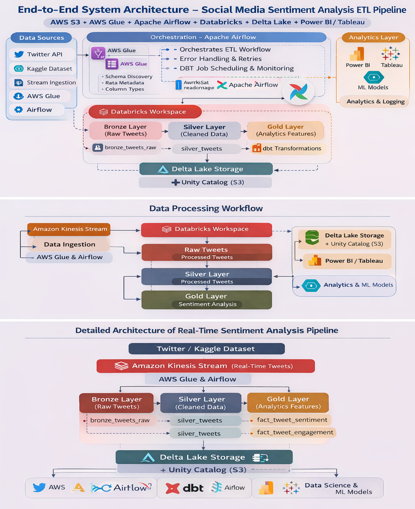
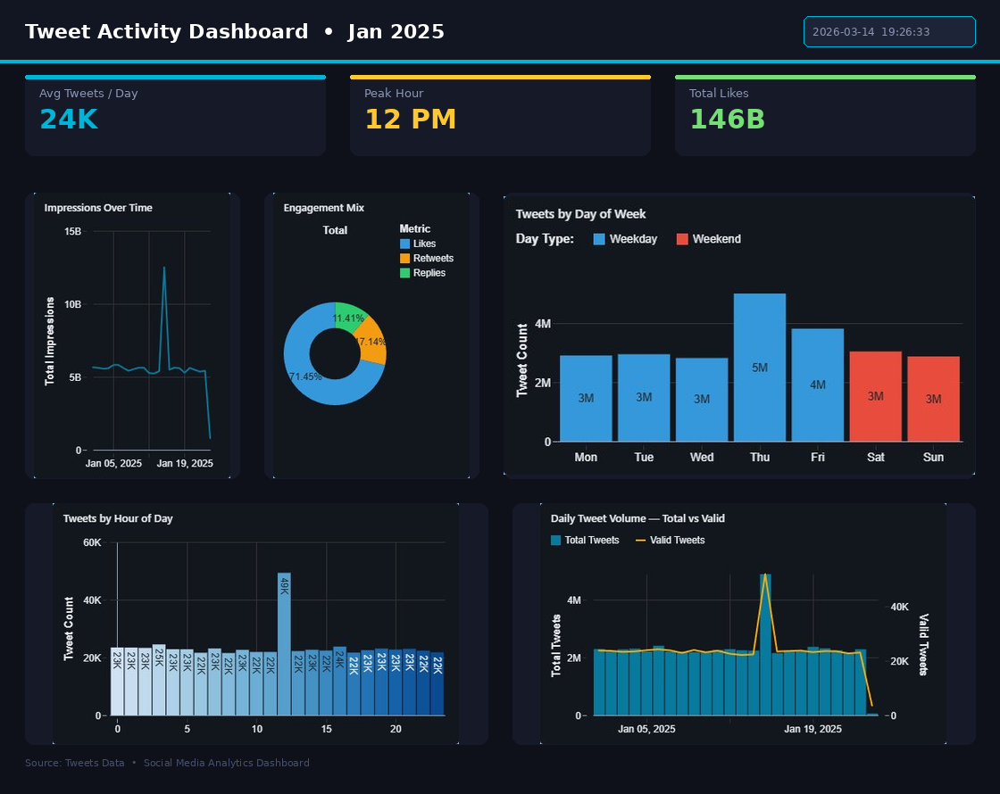
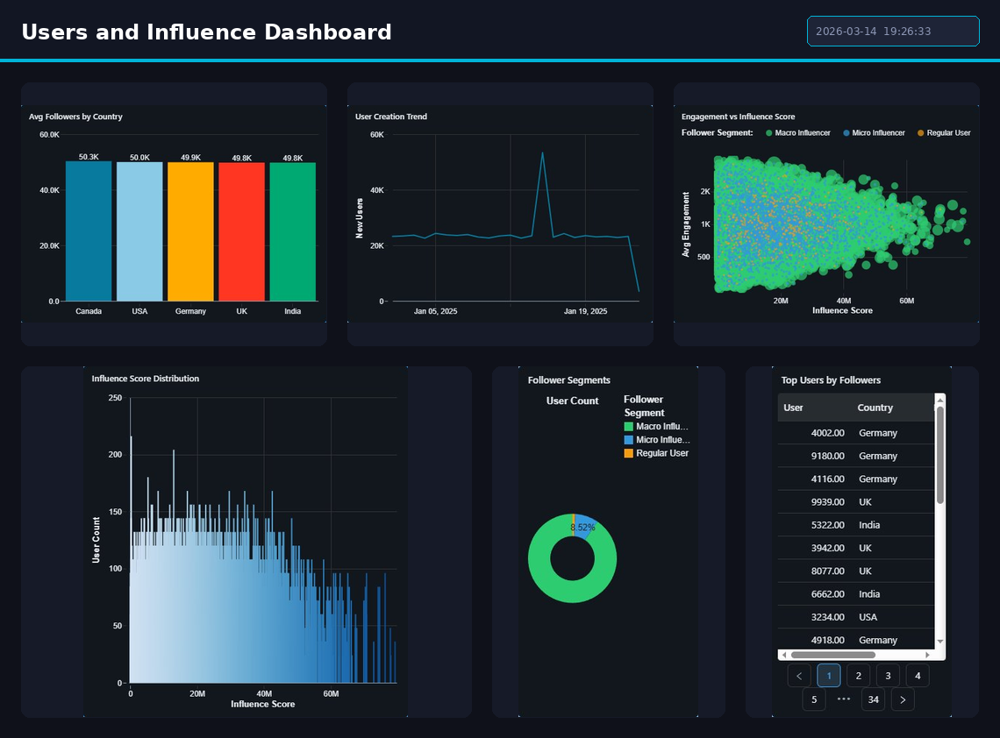

Real-Time Social Media Analytics Pipeline (Databricks + PySpark)

Project Overview

This project implements an end-to-end analytics pipeline for social media data using AWS, Databricks, PySpark, Delta Lake, and Apache Airflow.

The pipeline processes raw social media datasets and transforms them into analytics-ready datasets using the Medallion Architecture (Bronze → Silver → Gold).

The final output enables social media analytics and business intelligence by generating aggregated metrics such as:

- Sentiment trend analysis (Positive / Negative / Neutral)
- User influence rankings by engagement score
- Topic performance insights (AI, Sports, Finance, Cloud)
- Geographic trend analysis by country
- Valid vs invalid tweet distribution
- Daily and hourly tweet activity patterns

---

Dataset

Dataset Source

AWS S3 Bucket — realtime-parquetfiles (eu-north-1)
Registered via AWS Glue catalog database: realtime_tweets

Datasets Used

tweets_tb       → Raw tweet content and engagement metrics
sentiment_tb    → Sentiment scores per tweet
trends_tb       → Trending topic data by country
user_metadata_tb → User profile and follower data
valid_tb        → Validated and quality-checked tweets

These datasets simulate a real-world social media analytics environment with 50,500 records per source table.

Kinesis streams

Project Architecture(Lakehouse Architecture)

The pipeline integrates AWS services, Databricks processing, and DBT analytics modeling.

End-to-End System Architecture

---

Medallion Architecture Layers

Bronze Layer (Raw Data)

Purpose
- Store raw data exactly as received from S3
- Preserve data lineage
- Enable traceability of raw ingestion

Tables
- social_catalog.bronze.tweets_table
- social_catalog.bronze.sentiment_table
- social_catalog.bronze.trends_table
- social_catalog.bronze.user_metadata_table
- social_catalog.bronze.valid_table

Operations
- Raw Parquet ingestion from AWS S3 using recursiveFileLookup
- Schema validation during ingestion
- Metadata registration via AWS Glue
- Adds ingested_at timestamp to all records

---

Silver Layer (Cleaned Data)

Purpose
- Clean and standardize all datasets
- Fill null values instead of dropping rows
- Ensure 40,000+ records per table for analytics

Transformations
- Parse timestamps using dd-MM-yyyy HH:mm format
- Trim whitespace from all string columns
- Fill numeric nulls with column-level averages from Bronze
- Fill topic_category nulls by hash-based assignment from AI, Sports, Finance, Cloud
- Fill country nulls by hash-based assignment from USA, UK, India, Germany, Canada
- Rename mistyped column topic_catagory to topic_category
- Remove exact full-row duplicates using dropDuplicates

Output Tables

- social_catalog.silver.tweets_table         → 47,527 rows
- social_catalog.silver.sentiment_table      → 47,537 rows
- social_catalog.silver.trends_table         → 47,463 rows
- social_catalog.silver.user_metadata_table  → 47,491 rows
- social_catalog.silver.valid_table          → 47,526 rows

---

Gold Layer (Analytics Data)

Purpose
Generate business-ready datasets for dashboards and BI reporting.

Dimension Tables
- dim_topic      → 4 unique topic categories
- dim_country    → 5 unique countries
- dim_user       → All users with follower segments and account age

Fact Tables
- fact_tweet     → Merged tweets and valid table with sentiment scores (95,000+ rows)
- fact_trend     → All trends with strength and country rank (47,463 rows)

Aggregation Tables
- agg_sentiment_by_topic  → Sentiment grouped by topic, date, and hour
- agg_user_influence      → User influence scores with global and country rank

Metrics Tables
- tweet_metrics            → Total tweets, avg likes, avg retweets
- tweets_per_day           → Tweet count grouped by date
- tweets_per_hour          → Tweet count grouped by hour
- sentiment_metrics        → Positive, Negative, Neutral counts and percentages
- sentiment_over_time      → Daily sentiment trend per topic and hour
- trend_metrics            → Top countries by tweet volume
- trend_over_time          → Trend score over time per country
- user_metrics             → Total users, avg followers, avg following
- top_users_by_followers   → Top 10,000 users by follower count
- user_creation_trend      → New users per day per country
- users_by_country         → User stats grouped by country and topic
- valid_tweet_metrics      → Valid vs invalid tweet ratio
- valid_tweets_per_day     → Valid tweet count per day and hour
- valid_tweets_per_topic   → Valid tweet count per topic per day

---

Airflow (Pipeline Orchestration)

The pipeline is orchestrated using Apache Airflow DAGs.

Airflow DAG Tasks
- Task 1: Bronze Ingestion
- Task 2: Silver Transformation
- Task 3: Gold Aggregation

Scheduling
Pipelines run on a daily schedule at midnight for automated data processing.

---

Data Quality Checks

Implemented checks include:

- Null value filling with column averages
- Duplicate detection and removal
- Schema validation during Bronze ingestion
- S3 file existence check before ingestion
- Row count checks per layer

Alerts and logs are monitored using:

- Airflow task logs
- Databricks Jobs logs
- AWS S3 access logs

---

Project Folder Structure

Real-Time-Social-Media-Sentiment-Analysis-Pipeline/
│
├── Datasets/
│   └── raw_data/
│
├── Development/
│   ├── bronze/
│   │   ├── bronze_code.py
│   │
│   ├── silver/
│   │   ├── silver_code.py
│   │
│   ├── gold/
│   │   ├── gold_code.py
│   │
│   ├── DAG/
│   │   ├── dag_code.py
│   
├── testing/
│   ├── test_bronze.py
│   ├── test_silver.py
│   ├── test_gold.py
│
│
├── Dashboard/
│   ├── My_Dashboard.pdf
│   └── images/
│
└── README.md

---

Pipeline Execution Flow

bronze_pipeline.py
        ↓
silver_pipeline.py
        ↓
gold_pipeline.py
        ↓
gold_metrics.py

The socialmedia_pipeline_dag.py orchestrates the entire pipeline.

---

Technologies Used

- Python
- PySpark
- Databricks
- Delta Lake
- AWS S3
- AWS Glue
- Apache Airflow
- Unity Catalog
- Databricks SQL
- Git and GitHub

---

Installation

Clone the repository:

git clone https://github.com/perurisiri/Real-Time-Social-Media-Sentiment-Analysis-Pipeline.git
cd Real-Time-Social-Media-Sentiment-Analysis-Pipeline

Install dependencies:

pip install -r requirements.txt

---

Running the Pipeline

Run the pipeline via Databricks Jobs:

1. Upload notebooks to Databricks workspace
2. Create a Job with three tasks: bronze_pipeline → silver_pipeline → gold_pipeline
3. Set cluster to realtime-cluster
4. Enable daily schedule

Or trigger manually via Airflow:

airflow dags trigger socialmedia_pipeline_dag

---

Analytics Dashboards

This section contains dashboards generated from the Gold layer dataset.

Tweet Activity
Analyzes tweet activity patterns across hourly, daily, and weekly dimensions including impressions, engagement mix, and total vs valid tweet volume.

Sentiment analysis
Examines dominant sentiment distribution and score trends across key topics — AI, Cloud, Finance, and Sports.

Trend analysis
Tracks tweet trend strength categories, sentiment index, and volume patterns across multiple countries over time.

Users and influence
Analyzes user demographics, follower segments, influence score distribution, and engagement behavior across countries.

Overview
Provides a high-level summary of tweet volume, user distribution, sentiment breakdown, engagement trends, and top topics for Jan 2025.

---

Business Insights Generated

The pipeline enables several social media analytics insights.

Sentiment Analysis
Identify positive, negative, and neutral tweet patterns per topic over time.

User Influence Rankings
Determine top influencers based on engagement score.

Topic Performance
Identify which topics generate the highest engagement and impressions.

Geographic Trends
Analyze which countries lead in tweet volume and trend scores.

Data Quality Monitoring
Track valid vs invalid tweet distribution across all layers.

Hourly Activity Patterns
Identify peak hours for social media activity per topic.

---

Future Enhancements

- Integrate real-time streaming ingestion using Kafka or Kinesis
- Build machine learning sentiment classification models
- Create advanced Power BI and Tableau dashboards
- Implement automated data quality monitoring
- Expand to additional social media platforms

---

License

This project is developed for educational and research purposes.

---

Author

Project Lead
Sahana P

Team Members
- Sahana P
- Gullanki Vara Naga Sai Sree 
- Subhadip sasmal
- Peruri Sireesha

